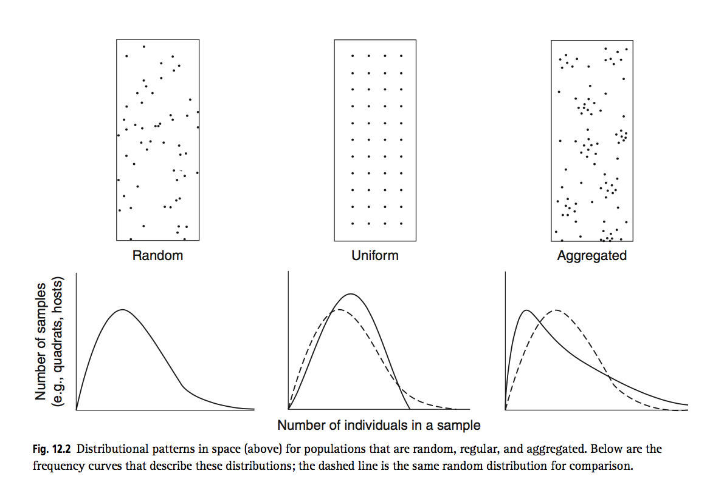

## Rationale           
Insect counts as a measure of pest resistance have been rarely used in QTL detection.
It is known that insects pests tend to agregate spacially and therefore their
distribution is neither uniform nor random. Hence assumptions of normal distribution
and homoscedasticity are often violated in insect counts, making linear models inadecuate for detecting QTLs associated to insect burden.

Recently, parasite counts, as a measure of disease burden, have been succesfuly used in GWAS for detecting candidate causative variants in disease genes in birds. The analysis showed that the best fitted model to this parasite data was a generalized linear mixed model (GLMM) with Negative Binomial error and logarithm as link function. One can expect that this model could fit plant pest counts as insect populations show the same type of spatial aggregation as vertebrate parasite populations.

There is no current QTL analysis software that enables the analysis of a Negative Binomial distributed phenotype in cross-pollinated, also known as full-sibling, populations. MapQTL, the standard available software, assumes normally distributed error of the phenotype and equal variance among genotypic classes. In order to obtain a well behaved phenotype, the GLMM serve as basis to calculate best linear unbiased predictor per plant clone, using plant clone as random effect. The calculated BLUPs are then employed in a traditional linear model for QTL detection, as has been previously shown for growth phenotypes in the rubber tree.

The `bugcount` scripts serve two functions:

1. `analysis.R` Compares the negative binomial GLM with ANOVA analysis of insect counts per analytical unit, plant or leaf. This script allows for calculation of plant clone means and 95% confidence interval, and determination of posthoc significantly different groupings. Statistical confidence, mean and dispersion can also be used for computing sample size in order to obtain a certain resolution between in the resistance of different clones at a given infestation level.  Furthermore Genotype $\times$ Environment (experiment) interaction is analysed as well using linear (ANOVA) and GLM methods.

2. `blup_heritability.R` postulates a mixed model for insect counts per analytical unit responding to plant clone, experiment and their interaction, all as random effects. This model is the base for variance partition and BLUPs calculation per plant clone. Variance partition allows for computation of heritability and genetic gain in order to select plant clones for further breeding taking into account the information from multiple experiments (environments). BLUPs are more normally distributed and can be used as phenotypes for QTL analysis.

$$log(y) =   log(\mu) + G_{i} + E_{i} + I_{GEij} + \epsilon_{i} + \eta_{ij}  $$
$$ \text{ where } \epsilon_{i} \sim NB(\theta_{\epsilon}, k_{\epsilon}) \text{ and } \eta_{ij} \sim NB(\theta_{\eta}, k_{\eta})$$

## Usage
### Analysis by plant insect count
    Rscript analysis.R  plant resistance_analysis wf_consolidated.tab \
            > plant_resistance_analysis.log 2>&1
    
    Rscript blup_heritability.R plant blup_analysis wf_consolidated.tab \
            > plant_blup_analysis.log 2>&1

### Analysis by leaf insect count
    Rscript analysis.R leaf resistance_analysis wf_consolidated.tab \
            > leaf_resistance_analysis.log 2>&1
            
    Rscript blup_heritability.R leaf blup_analysis wf_consolidated.tab \
            > leaf_blup_analysis.log 2>&1
    
